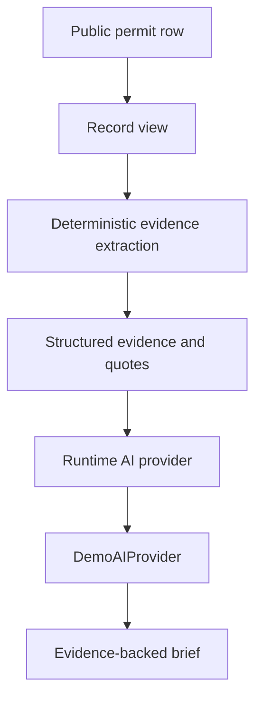

# HomeSignal

HomeSignal turns one public Pittsburgh permit record into quoted evidence, a structured extraction, and a simulated evidence-backed AI brief. Queue totals count **permit records**, not homes built.

It is a privacy-reduced review workspace for issued PLI descriptions (AI for Housing Hackathon / AI Horizons 2026, Track 2). A human still accepts or rejects every finding. HomeSignal provides decision support only. It is not legal, financial, zoning, permitting, or regulatory advice.

## The problem and who it is for

Housing analysts, planners, advocates, and journalists who report on production often start from public permit lists. Those lists mix new buildings, repairs, signage, and administrative corrections. Unit counts, when they exist at all, sit inside free-text descriptions. Doing this by hand means keyword-searching thousands of rows, retyping numbers, and separately guarding against counting stories, parking spaces, or issued permits as finished homes.

HomeSignal narrows the list to a housing review queue. For each record it shows the exact quote behind any number and states **what the record establishes, what it does not establish, and what to verify next**. It exports only what a person reviewed.

**Track fit.** Track 2 is the *Housing Production, Rents & Household Flow Observatory*. HomeSignal covers the **production-evidence** part of that observatory: it makes permit-level production signals traceable and bounded. Monthly metro rent and city survey context are shown separately. HomeSignal does not measure household flows, completions, or displacement.

Pittsburgh already has project and dashboard tools. The City’s [Affordable Housing Development Project Explorer](https://www.arcgis.com/apps/dashboards/603c22bb04ba4a478ad91d0758b7c262) (announced 17 April 2025) maps affordable developments completed, under construction, in process, or in the pipeline. The City Controller’s June 2025 special report on inclusionary zoning recommended a broader Pittsburgh housing-development dashboard, or expanding that Explorer. HomeSignal is not that city dashboard and does not replace it. It is a **privacy-reduced, evidence-first permit-description review** workflow: exact quotes stay attached to counts, and issued records stay separate from proposed units.

**Public repository:** https://github.com/Run-Disc/HomeSignal

A permit record is not a housing unit. An issued permit is not a completed or occupied home. HomeSignal does not score zoning feasibility. Official zoning sources say district and use rules vary by location and project scope, and that most building permits require zoning approval (ROZA). Code, map, and zoning pages are listed on Sources as **future verification links**, not as ingested data.

## Download (no Node.js)

Packages are **unsigned**. Windows SmartScreen and macOS Gatekeeper will warn. Open only files from this GitHub project.

| Platform | File | Where to get it |
|---|---|---|
| Windows (x64) | `HomeSignal-Setup.exe` | [Latest GitHub Release](https://github.com/Run-Disc/HomeSignal/releases/latest) |
| macOS Apple Silicon | `HomeSignal-mac-arm64.dmg` and `.zip` | [Latest GitHub Release](https://github.com/Run-Disc/HomeSignal/releases/latest) |
| macOS Intel | `HomeSignal-mac-x64.dmg` and `.zip` | [Latest GitHub Release](https://github.com/Run-Disc/HomeSignal/releases/latest) |

Every package is rebuilt from the public tag by GitHub Actions. The same files also appear as architecture-specific workflow artifacts. Packages stay in Releases because current Electron installers exceed GitHub's single-file repository limit.

Windows: [WINDOWS_INSTALL.md](./WINDOWS_INSTALL.md). macOS: [MAC_INSTALL.md](./MAC_INSTALL.md).

The browser workflow (`npm run dev` / `npm start`) is unchanged.

## Product path

Nav: **Queue** → **Record** → **Briefing**.

1. Queue shows issued / housing queue / reviewed / open, a neighborhood-responsive monthly activity chart, filters, search, and the permit table. Search `BDA-2024-05307` to open the scripted record.
2. Record is the permit description on the left and a human review form on the right. Select exact source words to copy them into the evidence field. **Extract evidence** fills a simulated proposal marked **Extracted — review required** until a person saves a decision (then **Accepted by reviewer**, **Corrected by reviewer**, and so on). **Analyze this record** runs a simulated, evidence-grounded brief for this row only, labeled **AI interpretation — non-authoritative**. The brief includes:
   - three lists: **What the record establishes**, **What it does not establish**, and **What to verify next**. The verify-next steps are conditional ("If you need evidence of delivered housing, check whether…") and never claim that other records exist;
   - **evidence coverage** with status words, not confidence percentages. Examples: source description *Available*, dwelling-unit language *Explicit*, construction completion *Not established*, occupancy *Not established*, related permits *Not checked*;
   - findings with a **Show in source** button for each citation, which highlights the exact quote in the source text;
   - **Copy record summary**, which puts source facts, reviewer status, and the labeled simulated AI section on the clipboard.
3. Briefing preserves the selected filters, highlights a featured source-backed count and its exact quote, identifies the next human verification step, and prints or downloads **reviewed** evidence only. A simulated AI brief, if generated in this browser, is labeled separately and is not mixed into queue totals.

## Judging alignment

| Criterion | Demonstrated behavior |
|---|---|
| Problem value | Converts 4,243 issued-permit rows into a 727-record housing review queue and separates what each record proves from what it does not. |
| User fit & usability | Plain-language Queue → Record → Briefing workflow; guided example; selection-to-quote evidence capture; human-review status chips; keyboard focus, large controls, mobile record cards, and print output. |
| Technical execution | Deterministic local snapshot, typed provider interface, Zod-validated API responses, validated review persistence, CSV formula protection, source-bound count checks, automated tests, and desktop packages. |
| Data & AI integrity | Cited WPRDC snapshot; privacy-reduced fields; exact supporting excerpts with Show in source; explicit unknowns; simulated runtime AI labeled non-authoritative and grounded in the open record; human decision required. |
| Actionability | Every brief ends with conditional verification steps, and Copy record summary or Briefing hands a cited result to a colleague without an unsupported production total. |
| Continuation potential | Phased pilot plan below, with a named measurement for each phase and no claimed partners. |

No score is guaranteed. The demo and documentation show the working evidence for each criterion so judges can evaluate it directly.

This repository’s default path is **source-review plus simulated runtime AI**. There is no vendor API key. Queue totals stay deterministic snapshot metrics. Human reviews stay human-entered. Runtime AI on the Record screen is a local demo provider (`POST /api/ai/analyze` and `POST /api/ai/ask`; labeled demo extraction through `POST /api/extract`) labeled **Runtime AI · Demo**. Cursor is not used at runtime.



A live OpenAI-compatible provider can replace `DemoAIProvider` behind the same interface. The demo path needs no API key and does not leave the machine.

## Libraries and tools

Names describe what this repository uses. They are **not endorsements**.

| Name | Role |
|---|---|
| Next.js 15, React 19, TypeScript, Zod | Web app |
| Node.js 22 / npm | Install, tests, production server |
| WPRDC / CKAN | PLI Permits dump (not a paid API) |
| Optional OpenAI-compatible Chat Completions | Server `POST /api/extract` **only if** `EXTRACTION_API_KEY` and `EXTRACTION_MODEL` are set. **Not configured here.** Default extraction uses a local labeled demo matcher. |
| Simulated runtime AI | `DemoAIProvider` behind `POST /api/ai/analyze` and `POST /api/ai/ask`. Same interface a future live provider would implement. **No external request.** |
| Cursor (including Grok) and OpenAI Codex | Development assistance for code, debugging, tests, interface improvements, documentation, and demo preparation. Pre-event AI consultation supported public-source research and early sketches; no application code. **No runtime use.** See [AI disclosure](./AI_DISCLOSURE.md). |
| Electron + electron-builder | Unsigned Windows NSIS and macOS DMG/ZIP wrappers around the same Next standalone app |

Python 3 is used only for optional ingest (`scripts/ingest_pli.py`). The committed snapshot is enough to run. `vercel.json` exists; **no hosted deployment is claimed**.

## Data provenance

| Item | Value |
|---|---|
| Source | City of Pittsburgh PLI Permits via WPRDC |
| Resource | `f4d1177a-f597-4c32-8cbf-7885f56253f6` |
| Retrieval | 2026-09-26 CKAN dump (65,378 rows; catalog HTML preview listed 49,255) |
| License | Creative Commons Attribution |
| Product cohort | 2025 issue dates, `BUILDING` or `Building & Development Application` |
| Unique IDs | 4,243 |
| Housing queue (keyword / work-type discovery) | 727 |
| Snapshot | `pli-2025-bda-v1` |

Fields used: permit ID, permit type, source class, work type, issue date, current status, neighborhood, and work description. Descriptions are privacy-reduced (street patterns redacted). Owner, contractor, address, parcel, coordinates, and value fields are dropped at ingest.

**What this source establishes:** that the City issued a permit with this ID, type, date, neighborhood, and public description, and its administrative status at retrieval. **What it does not establish:** construction start, completion, occupancy, affordability, or whether several permits describe one project. Status is a current label, not a history.

See `SOURCES.md` and `DATA_DICTIONARY.md`. Zoning code, map, and City zoning pages stay unused context for later lookup.

## Privacy

Owner names, contractor names, street addresses, parcel identifiers, coordinates, project value, and contact fields are not in the public snapshot, UI types, extraction prompt payload, or CSV/print export.

On ingest, descriptions are scanned for emails, phones, owner/contractor/contact phrases, and house-number street patterns. Matching street patterns became `[REDACTED_ADDRESS]` (21 records on 2026-09-26). Residual personal data would exclude a record (0 exclusions). Automated redaction is incomplete.

## AI at runtime

- Cursor coding assistance is **not** a visitor API key and is **not** used while the app runs.
- Default mode is source-review. `POST /api/ai/analyze` uses a **simulated** local provider (`runtimeMode: "simulated"`, `provider: "demo"`). It does not call OpenAI, Cursor, or Grok.
- Demo extraction and demo briefs quote only the open snapshot row. They are not mixed into citywide permit metrics.
- `saved-extractions.json` is `[]`. No genuine saved vendor responses are claimed.
- `data/evaluation/adversarial-synthetic.json` is labeled **synthetic_adversarial**. Those strings are not City records, are not shown in the queue, and are excluded from factual metrics.
- To swap in a real provider later: implement `RuntimeAiProvider`, set a server-side key, validate JSON against the existing schema, and keep the Record UI.

## Human review

Manual review works with no model output. Reviews stay in this browser’s `localStorage` for the snapshot version. They are not City determinations. Metrics never sum unit mentions into a citywide homes-built total.

## Limitations (short)

No construction-start, completion, or occupancy inference. No proposed→issued→completed funnel. Blank descriptions: 2,417 of 4,243 cohort records. No accuracy percentage: the labeling sheet is unlabeled. No zoning feasibility. Details: `LIMITATIONS.md`, `EVALUATION.md`, `AI_DISCLOSURE.md`.

## Run locally

Requires Node.js 22+ (or `export PATH="$PWD/.tools/node/bin:$PATH"`).

```bash
npm install
npm test
npx tsc --noEmit
npm run dev
```

Open http://localhost:3000

```bash
npm run build
npm start
```

Optional live extraction: copy `.env.example` to `.env.local`. Never commit keys. Demo runtime AI needs no key.

Desktop packages (unsigned):

```bash
npm run desktop:win      # Windows NSIS (CI on windows-latest)
npm run desktop:mac      # macOS DMG+ZIP for arm64 and x64
```

## Continuation plan (proposed, not completed)

Possible pilot users are municipal housing analysts, housing nonprofits, university housing researchers, and local newsrooms. These are organization types only. **No partner or agency has agreed to a pilot.**

| Phase | Work | What we would measure |
|---|---|---|
| 1. Practitioner pilot | Two or three practitioners review the same 30–50 permits (commercial-class housing, repairs, blank descriptions) with the raw source and with HomeSignal. | Minutes per record; number of corrections to extracted fields; whether each citation was judged useful. No time saving has been measured yet. |
| 2. Independent labels | Label the review corpus independently before any model comparison. | Agreement by count type and ambiguity category, not a single invented accuracy score. |
| 3. Production provider | Implement `RuntimeAiProvider` with a server-side OpenAI-compatible model and keep the same Zod schema and grounding checks. | Extraction precision and recall against phase 2 labels; share of responses rejected by validation; unsupported-claim rate (target: zero). |
| 4. More record types | Add inspection, completion, or certificate-of-occupancy record types only where public sources exist, each linked by permit ID and labeled separately. | Share of briefs where "Not established" items become verifiable. |
| 5. Batch review queues | Let a reviewer work through a filtered batch with saved progress and a combined cited export. | Records reviewed per session; stale-review rate after snapshot refresh. |

Throughout, refresh a versioned snapshot, review schema and privacy changes, and require re-review whenever source text changes. Current exports already exclude reviews whose source hash no longer matches.

The product combines a permit-evidence workflow with separately labeled monthly metro rent and city community context. It does not measure household flows, completion, displacement, or neighborhood affordability, and has not been tested by an external practitioner.

## License and attribution

Original HomeSignal code, interface, and documentation are **all rights reserved** and licensed only for review by AI for Housing Hackathon judges and authorized organizers. Copying, modification, redistribution, replication, commercial use, derivative works, and use for AI or machine-learning training or evaluation are prohibited without prior written permission. See [`LICENSE`](./LICENSE).

Third-party materials remain under their own terms. Permit data remains a City of Pittsburgh dataset published by WPRDC under Creative Commons Attribution; Zillow Research, U.S. Census Bureau, and software dependency materials remain subject to their respective terms and licenses. Prototype review is not an official City determination.

## Benefits, risks, and unanswered questions

Planners, advocates, and journalists can trace public housing claims to source evidence. Residents benefit from clearer distinctions between proposed work and occupied homes. Incomplete descriptions and uneven reporting can hide activity; using them to label neighborhoods, direct investment, allocate benefits, or automate enforcement could harm residents. Do not use this prototype for those decisions. Humans must verify source meaning and current City records.

The Queue also includes monthly Zillow metro rent and Census city survey context. See [Sources](./SOURCES.md) for datasets, retrieval dates, definitions, and reconciliation. We lack reliable linked completion, occupancy, household-flow, displacement, and neighborhood affordability data, so HomeSignal does not answer those questions.
